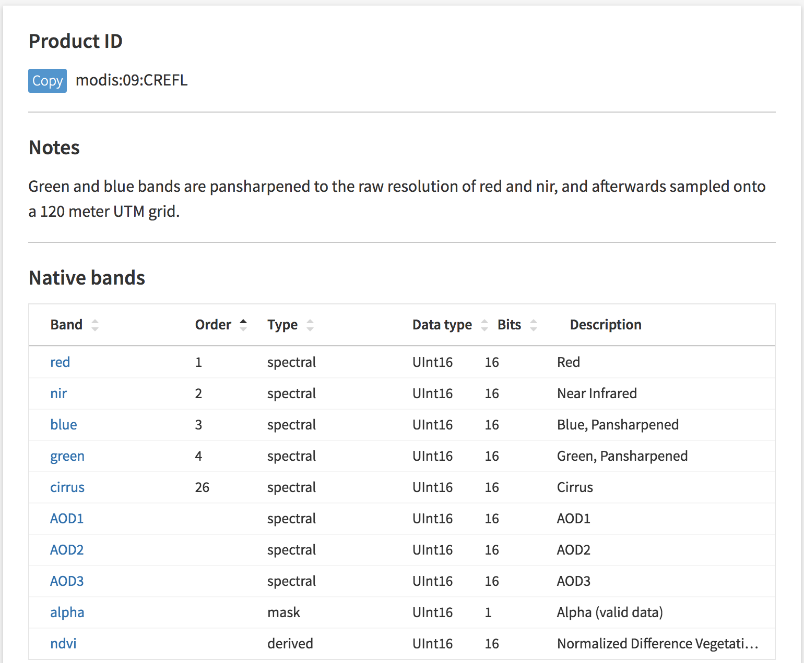

Using Catalog to Search for Imagery
==========================

Our `Catalog <https://catalog.descarteslabs.com/?/>`_  interface allows users to search data products available on the Platform.  Utilizing Catalog is a great way to become familiar with data products and their metadata. It also allows users to manage their own datasets. All raster products uniquely available or owned by a user are shown in Catalog.  You have the option to toggle between "Descartes Labs products" as well as "My products".  

View Product Details 
~~~~~~~~~~~~~~~~~~~~
Clicking on a layer's entry will open a dedicated page that shows all the associated metadata of the product. Here is the page for `MODIS Aqua Terra <https://catalog.descarteslabs.com/?/product/modis:09:v2>`_, for example. One of the first things to point out is the Product ID. This ID is used to search for imagery programatically in the Python client. 

The product's band information is also displayed here, including if they are native to the platform or sensor.  All associated metadata about the bands are listed as well, in terms of band type, data type and a short description of the band. Clicking a band provides more information specific to that band.  It has important information such as spatial resolution (resolution, resolution_unit), processing level (processing_level), and the range of the data (data_range).  

Below the Native bands you will see the derived bands. These derived bands often reflect common layers used in geospatial analysis, including an NDVI band. One important thing to note is that this band is a 30 day average.  Users have to compute NDVI at a different temporal resolution if they require them at this time. Clicking on “derived:ndvi” band gives more information on the band, including the Band ID. This information is available programmatically in our Python client as well, though the Catalog interface is a great way to “discover” data.  

Product Extent
~~~~~~~~~~~~~~
For each product, the number of scenes available is coveniently plotted by date toward the bottom of the product details panel. To limit the search by geographic extent, you must programatically search using the Scenes API or our `Viewer interface <https://viewer.descarteslabs.com/>`_.
