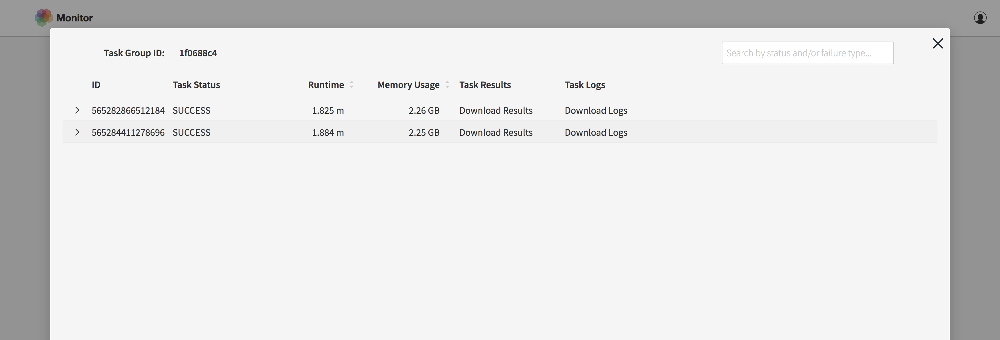

Monitor Scalable Tasks 
==========================
The monitor interface allows users to view the status and progression of scalable compute tasks launched using the Tasks API. The interface reports the number of tasks submitted, the number of workers launched, and the status of each task within a task group. Upon completion, you can also access each individual task’s log to see errors or other console print outs.

The landing page lists all running task groups, their status, number of pending tasks, and active workers. To view the status of each individual task within a task group, click on the task group ID. As the individual tasks are picked up by workers and completed, they appear with an ID, status, runtime, and memory usage listed. They also allow users to download text file results returned and task logs to inspect errors. 

This interface also allows users to manage their task groups by stopping and removing them. An archive of all stopped tasks can be viewed under the "Terminated" tab on the landing page. 