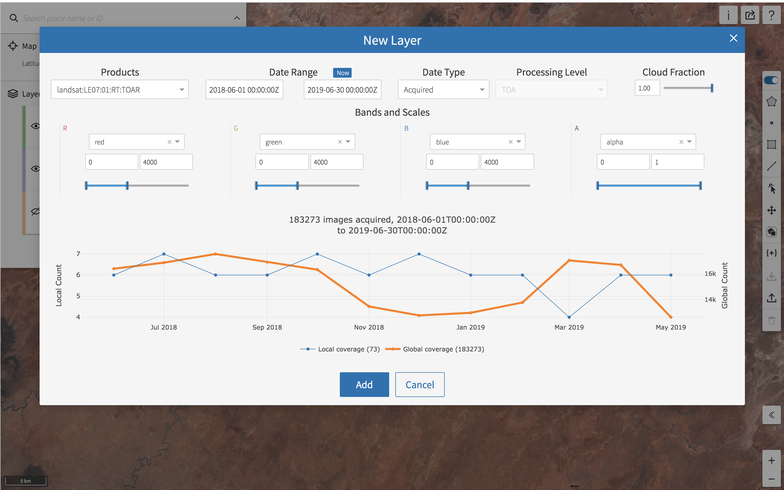

Accessing Product Information from Viewer
==========================

Viewing & Hiding Layers 
~~~~~~~~~~~~~~~~~~~~~~~

Open this `Viewer link <https://viewer.descarteslabs.com/?config=a68b8760c9f727a431366be7a0a2f515ca79581a>`_ set in Northeast Arizona.  In the map menu, there are three layers with different datasets loaded including Landsat-8, Sentinel-2, and GOES-16.  

Toggle a layer’s visibility on and off using the button to the left of the layer's name represented by an eye. Use the hotkeys J and K to cycle layers up and down.  All of the keyboard shortcuts are explained in the general tips and map toolbar legend. Click the question mark in the top right corner of the Viewer window to open the tips and toolbar legend. 

Adding a New Layer
~~~~~~~~~~~~~~~~~~

In the map menu click the ‘Add Layer’ button. Find the Landsat-7 Top of Atmospheric Reflection product (‘landsat:LE07:01:RT:TOAR’ ). You can manually select the date range. Here, the date range is set to encompass June 2018.  

Changing a Layer’s Opacity
~~~~~~~~~~~~~~~~~~~~~~~~~~

Use the opacity slider beside the desired layer's name to adjust its opacity.

Using the Timeline Slider
~~~~~~~~~~~~~~~~~~~~~~~~~

GOES-16 has an incredible temporal resolution. To browse datasets temporally, use the timeline slider. Click the second button from the right by a layer's name to anchor it to timeline, which will appear horizontally at the bottom of the screen. Change the unit of time in the bottom right hand corner by selecting "Minute", "Day", "Hour", or "Week". Orange blocks on the slider indicate the presence of imagery. 

Toggling Scene Outlines
~~~~~~~~~~~~~~~~~~~~~~~
To toggle scene outlines, click the third button from the right by a layers name in the map menu.

Turning map labels on and off
~~~~~~~~~~~~~~~~~~~~~~~~~~~~~
Toggle the placenames and boundaries on and off, click flag icon in the top right corner of the layer window. 

Exploring Band combinations
~~~~~~~~~~~~~~~~~~~~~~~~~~~

In the Viewer window, click the ellipsis beside a layer. Next, click “Edit Layer” to access product information and configurations. Inside of the menu, you will see information contained about the selected layer.  Under the “Products” field you will see the product id.  You can use this product id and date range to query for scenes. Play around with different band combinations (*NIR and SWIR2 are great to look at in Sentinel-2 and Landsat-8).

Feature Metadata
~~~~~~~~~~~~~~~~
To find the complete metadata associated with a feature, select the comment box icon in the top right hand corner of the layer window and click on an image to access the complete metadata associated with a feature.  

Searching for Locations
~~~~~~~~~~~~~~~~~~~~~~~
Searching for locations in Viewer utilizes our Places API.  

Drawing points, lines and polygons
~~~~~~~~~~~~~~~~~~~~~~~~~~~~~~~~~~
Users can add polygons, points, squares and line vector features to your Viewer window. To access these tools, expand the toolbar menu on the right hand side of the window and begin editting. 

Saving &  Loading geojson files
~~~~~~~~~~~~~~~~~~~~~~~~~~~~~~~
On the side of the Viewer window, click to save features that were created using the draw function.  You may have to select individual features using. The features will be saved to your downloads folder as a .geojson.

To load a .geojson into viewer, click the "Upload features" button. 

Sharing your Viewer Link
~~~~~~~~~~~~~~~~~~~~~~~~
In the top right hand corner of the Viewer window find the arrow icon. To get the Shareable Viewer URL click the clipboard icon. This viewer link will maintain the layers loaded, layer configurations, and zoom level and context. 

Finding the TMS link for Analytics Studio
~~~~~~~~~~~~~~~~~~~~~~~~~~~~~~~~~~~~~~~~~
Users can export layers from Viewer to Analytics Studio. Click next to the layer to export and then click the option to Export the layer. A dialog box will appear that has the option to copy three different types of static urls:  TMS URL, ArcGIS Tile Layer URL and a Tableau TMS XML URL. Copy the TMS URL using the clipboard icon. Open up `Analytics Studio <https://analytics.descarteslabs.com/>`_ In `Map Settings` expand the options for Base Map.  Choose the option for `Add Custom Basemap.`Paste in your TMS URL into the first field. Then click `Add Basemap.`
